# orange网关传统集群部署模式

1、在orange.conf的 `plugins`中加入node，表示开启node插件（**容器集群节点管理插件**）

```yaml
    "plugins": [
        "stat",
        "headers",
        "monitor",
        "redirect",
        "rewrite",
        "rate_limiting",
        "property_rate_limiting",
        "basic_auth",
        "key_auth",
        "jwt_auth",
        "hmac_auth",
        "signature_auth",
        "waf",
        "divide",
        "kvstore",
        "node"
    ],
...
    "api": {
        "auth_enable": true,
        "credentials": [
            {
                "username":"api_username",
                "password":"api_password"
            }
        ]
    }
```

2、部署多个orange节点，同时在每个节点的dashboard启用node插件
3、每个节点dashboard，集群管理中先注册节点添加自己，然后添加节点依次加入其它节点，需要输入其他节点的 ip 端口(7777) 用户名 和 密码

4、A节点的dashboard修改完配置, 在其他节点的dashboard上点击同步配置进行同步

orange多节点主要是同步各节点的数据，这样的话只要在一个节点做配置，其他节点都能同步到

# 传统模式在k8s的环境下面临几个问题

1. 在无状态的部署下存在一些问题，如下（下图部署两个副本进行测试，注意图中的**Address**，访问后台时默认处于**轮询**状态）


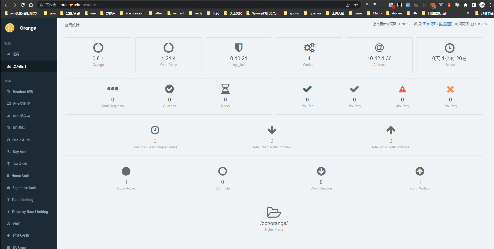

2. Orange多节点之间以ip进行通信，但orange的dashboard也对添加/修改集群节点的输入框做了限制（只能写ip，所以这里还需要对源码以及**数据库字段长度**进行调整）

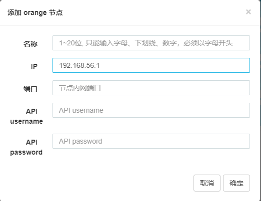

4. Orange的默认使用`lua_shared_dict`缓存数据（其中包括插件的配置数据），所以有以下几个问题

   - 在`dashboard`配置完插件后只在当前节点具有数据可见性，其他节点必须点击**同步配置**，才可生效新配置。这就导致网关服务默认只能以**有状态**方式部署
   - OpenResty/Nginx 的共享内存区是消耗物理内存的：意味着它存储的数据并不是保存在文件系统中的，而是直接存储在操作系统的内存中。因此，共享内存中的数据是暂时性的，一旦Nginx进程退出或重启，共享内存中的数据就会被清空。所以在容器无法挂载这部分数据，也无法持久化这部分数据。参考：https://blog.openresty.com.cn/cn/how-nginx-shm-consume-ram/

5. 关于共享内存这里，计划全改成**Redis**，但是也遇到了几个问题

   - 有些缓存操作是放在`init_by_lua`和`log_by_lua`中的，但是这类模块不允许操作redis。如果操作对应api会报错：` API disabled in the context of xx_by_lua`

     解决办法：如果一定要在这当中执行redis操作，可以在调用Redis模块之前，使用`ngx.timer.at(0, function() ... end)`将代码延迟到下一个请求周期中执行，这样就可以避免在`*_by_lua`上下文中使用Redis模块了。

     ```lua
     -- 在log_by_lua*上下文中使用ngx.timer.at延迟执行Redis操作
     ngx.timer.at(0, function()
         local redis = require "resty.redis"
         local red = redis:new()
         local ok, err = red:connect("127.0.0.1", 6379)
         if not ok then
             ngx.log(ngx.ERR, "failed to connect to Redis: ", err)
             return
         end
         -- 执行Redis操作
         local res, err = red:get("mykey")
         if not res then
             ngx.log(ngx.ERR, "failed to get Redis key: ", err)
             return
         end
         ngx.log(ngx.INFO, "Redis key value: ", res)
         red:set_keepalive(10000, 100)
     end)
     ```

   - orange的全局统计插件中的部分数据如活跃连接数，这里是取自当前网关节点的`ngx.var.connections_active`，这是个动态值。与此相似的还有其他数据。这类监控数据不适合定性存储

   - 涉及到`lua_shared_dict orange_data`的代码地方较多。但orange_data仅供**缓存插件配置**，可以不做持久化。
   
     数据加载流程：网关服务启动 -> 从**数据库**加载插件数据 -> 缓存至**orange_data**
   

# 开发/改造

**针对0.8.1分支进行改造**

> 代码见: [GitHub - behappy-other/orange at v0.8.1-k8s](https://github.com/behappy-other/orange/tree/v0.8.1-k8s)

## luarocks依赖版本调整

- orange-master-0.rockspec

> lua-resty-kafka -> 0.09-0
>
> luafilesystem -> 1.8.0-1

## 数据库字段长度调整

```sql
alter table cluster_node
    modify name varchar(255) default '' not null;

alter table cluster_node
    modify ip varchar(255) default '' not null comment 'ip';

alter table persist_log
    modify ip varchar(255) default '' not null comment 'ip';
```

## 注册节点IP逻辑调整

- 去掉注册节点时的ip限制
- 在`nginx.conf.example`中添加`env ORANGE_SERVICE;`（默认值为`orange-headless`），后续将使用`socket.dns.gethostname() .. "." .. os.getenv("ORANGE_SERVICE")`做为注册ip（k8s中，结合`statefulset + headless service`可将流量打在指定pod）
- 在`orange.conf.example`中添加`node`插件

## 配置分流，及DNS解析

- 配置**nginx.conf.example**，添加**kube-dns**，使**k8s环境**下可以解析对应**service name**

```nginx
http {
    # 修改kube-dns, 使k8s环境下可以解析对应service name
    # resolver 114.114.114.114; # replace it with your favorite config
    resolver kube-dns.kube-system.svc.cluster.local;
    ...
```

- 添加**server**，按**`Header：oranger-version`**对**dashboard**进行分流

> 通常情况下，Kubernetes集群中的DNS服务器（kube-dns或CoreDNS）会自动为服务名称添加完整的域名（例如`service.{namespace}.svc.cluster.local`）。但是，如果在Nginx配置文件中指定了其他DNS服务器，则需要自行添加完整的服务名称。
>
> 例如，如果在Nginx配置文件中指定了 第三方 DNS服务器（8.8.8.8），则需要在`proxy_pass`指令中使用完整的服务名称，例如`http://service.{namespace}.svc.cluster.local:port`。

```nginx
# orange dashboard fronted
server {
    listen 8888;
    access_log off;
    error_log off;

    location / {
        # 设置默认路由地址.orange-0为pod名称，同时也是该pod的hostname，格式为：orange-{n}
        set $backend "http://orange-0.orange-headless.default.svc.cluster.local:9999";
        # 检查标头
        if ($http_orange_version) {
            set $backend "http://${http_orange_version}.orange-headless.default.svc.cluster.local:9999";
        }
        # 路由到dashboard的后端服务
        proxy_pass $backend;
    }
}
```

- 获取真实remote ip

```nginx
http {
    ......
    # update remote-addr/real-ip
    set_real_ip_from    0.0.0.0/0;
    real_ip_header      X-Forwarded-For;
    real_ip_recursive   on;

    map $http_upgrade $connection_upgrade {
        websocket upgrade;
        default $http_connection;
    }
```

- 解决`426 upgrade required`问题：nginx反向代理默认走的http 1.0版本

```nginx
http {
    ......
    # 解决426问题：nginx反向代理默认走的http 1.0版本
    proxy_http_version 1.1;
```

## 调整使用到`lua_shared_dict`的插件，将其改成`Redis`

- rate_limiting
- monitor
- waf
- stat
- property_rate_limiting

## 调整`Makefile`，改良服务的启动速度

> 将下载依赖的步骤单独提出来，之后只要`rockspec`文件内容不变，就不需要额外下载依赖

- 去除`make dev`操作中的`luarocks install ...`指令
- 新增`make dependency`指令

```makefile
### dependency:          install the dependencies from .rockspec
.PHONY: dependency
dependency:
ifneq ($(LUAROCKS_VER),'luarocks 3')
	luarocks install rockspec/orange-master-0.rockspec --server=https://luarocks.cn --tree=deps --only-deps --local
else
	luarocks install --server=https://luarocks.cn --lua-dir=/usr/local/openresty/luajit rockspec/orange-master-0.rockspec --tree=deps --only-deps --local
endif
```

## property_rate_limiting插件 - 防刷功能添加封禁时长

- 未配置封禁时间，则按429处理 -> 限流
- 配置了封禁时间，则按403处理 -> 指定时间内不可访问

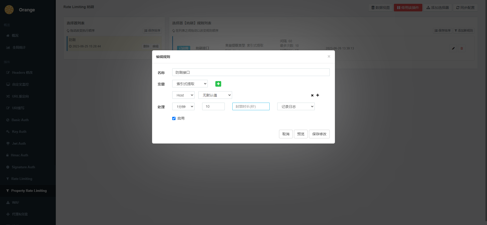

## Dockerfile

```dockerfile
FROM centos:7
WORKDIR /opt/orange
EXPOSE 80 7777 8888 9999
RUN ln -snf /usr/share/zoneinfo/Asia/Shanghai /etc/localtime \
    && yum update -y \
    && yum install -y wget \
    # install epel, `luarocks` need it.
    && wget http://dl.fedoraproject.org/pub/epel/epel-release-latest-7.noarch.rpm \
    && rpm -ivh epel-release-latest-7.noarch.rpm \
    # install some compilation tools
    && yum install -y yum-utils git libuuid-devel pcre-devel openssl-devel gcc gcc-c++ make perl-Digest-MD5 lua-devel cmake3 curl libtool autoconf automake openresty-resty readline-devel unzip gettext kde-l10n-Chinese which net-tools \
    && yum -y reinstall glibc-common \
    && ln -s /usr/bin/cmake3 /usr/bin/cmake \
    && localedef -c -f UTF-8 -i zh_CN zh_CN.utf8
ENV LC_ALL zh_CN.utf8
RUN cd /usr/local/src \
    && git clone https://gitee.com/xiaowu_wang/lor.git \
    # install lor
    && cd lor \
    && make install
RUN cd /usr/local/src \
    # install luarocks
    && git clone https://gitee.com/xiaowu_wang/luarocks.git \
    && cd luarocks \
    && git checkout v3.9.2 \
    && ./configure --prefix=/usr/local/luarocks --with-lua=/usr --with-lua-include=/usr/include \
    && make \
    && make install \
    && ln -s /usr/local/luarocks/bin/luarocks /usr/local/bin/luarocks
RUN cd /usr/local/src \
    # install openresty,sticky and compile
    && wget https://openresty.org/download/openresty-1.21.4.1.tar.gz \
    && wget https://bitbucket.org/nginx-goodies/nginx-sticky-module-ng/get/08a395c66e42.zip -O ./nginx-goodies-nginx-sticky-module-ng-08a395c66e42.zip \
    && tar -xzvf openresty-1.21.4.1.tar.gz \
    && unzip -D nginx-goodies-nginx-sticky-module-ng-08a395c66e42.zip \
    && mv nginx-goodies-nginx-sticky-module-ng-08a395c66e42 openresty-1.21.4.1/nginx-sticky-module-ng \
    && cd openresty-1.21.4.1 \
    && ./configure --prefix=/usr/local/openresty --with-http_stub_status_module --with-http_v2_module --with-http_ssl_module --with-http_realip_module --add-module=./nginx-sticky-module-ng \
    && make \
    && make install \
    && ln -s /usr/local/openresty/nginx/sbin/nginx /usr/bin/nginx \
    && ln -s /usr/local/openresty/bin/openresty /usr/bin/openresty \
    && ln -s /usr/local/openresty/bin/resty /usr/bin/resty \
    && ln -s /usr/local/openresty/bin/opm /usr/bin/opm \
    && openresty
# 提前构建
COPY rockspec ./rockspec/
COPY Makefile ./Makefile
RUN make dependency
COPY . .
CMD make dev && make install && resty bin/orange start && tail -f /opt/orange/logs/access.log
```

## Statefulset.yaml

```yaml
apiVersion: v1
kind: Service
metadata:
    name: orange-headless
spec:
    publishNotReadyAddresses: false
    clusterIP: None
    selector:
        app: orange
---
apiVersion: v1
kind: Service
metadata:
    name: orange
spec:
    selector:
        app: orange
    ports:
        - port: 80
          name: http-web
          targetPort: 80
          nodePort: 35080
          appProtocol: HTTP
        - port: 7777
          name: http-api
          targetPort: 7777
          nodePort: 35077
          appProtocol: HTTP
        - port: 8888
          name: http-fronted
          targetPort: 8888
          nodePort: 35088
          appProtocol: HTTP
        - port: 9999
          name: http-admin
          targetPort: 9999
          appProtocol: HTTP
    type: NodePort
---
apiVersion: apps/v1
kind: StatefulSet
metadata:
    name: orange
    labels:
        app: orange
spec:
    serviceName: orange-headless
    updateStrategy:
        type: RollingUpdate
        rollingUpdate:
            maxUnavailable: 0
    replicas: 2
    selector:
        matchLabels:
            app: orange
    template:
        metadata:
            labels:
                app: orange
        spec:
            containers:
                - name: orange
                  image: $REGISTRY_ADDRESS/${NODE_ENV}/${CI_PROJECT_NAME}:v${CI_PIPELINE_ID}
                  imagePullPolicy: IfNotPresent
                  lifecycle:
                      preStop:
                          exec:
                              command:
                                  - /bin/sh
                                  - -c
                                  - "while [ $(netstat -plunt | grep tcp | wc -l | xargs) -ne 0 ]; do sleep 1; done"
                  livenessProbe:
                      tcpSocket:
                          port: 80
                  readinessProbe:
                      tcpSocket:
                          port: 80
                  env:
                      - name: ORANGE_SERVICE
                        value: orange-headless
                  ports:
                      - containerPort: 80
                      - containerPort: 7777
                      - containerPort: 8888
                      - containerPort: 9999
            dnsPolicy: ClusterFirst
            restartPolicy: Always
```

# 测试

## 多副本

### 扩容测试

> 新副本可以在10秒内启动成功

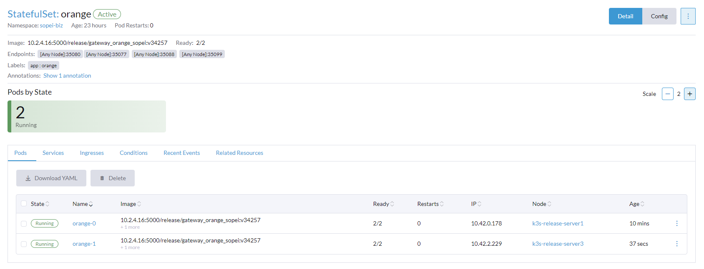

### 访问测试

> 多次访问，呈轮询效果

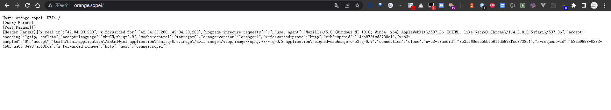

## 控制台

> 访问8888端口，根据自定义`header：orange-version`，将流量打入指定pod上

### 节点注册

- 添加自定义header

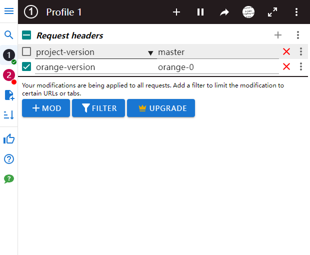

- 查看全局统计（此处如果传的`header：orange-version`为`orange-1`，则Address呈现为`orange-1`）

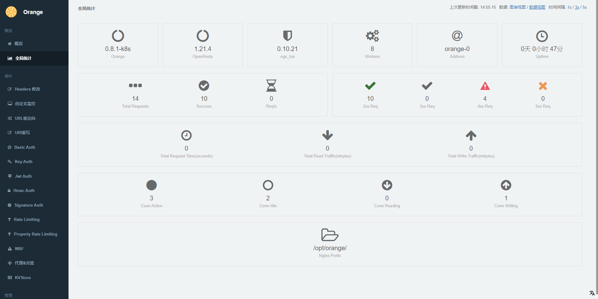

- 分别注册**orange-0**和**orange-1**节点

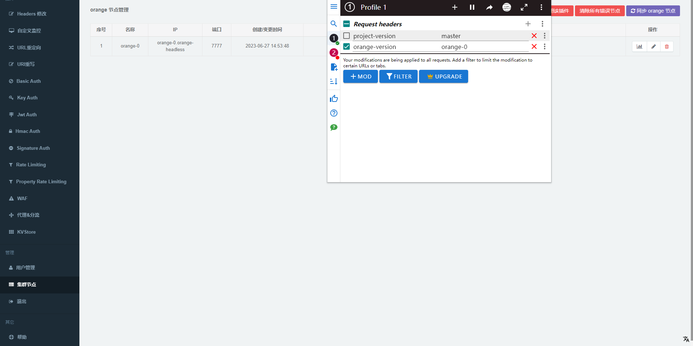

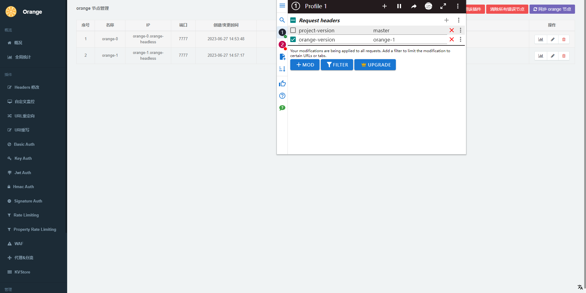

### 配置同步

- 在**orange-0**节点**配置防刷插件**

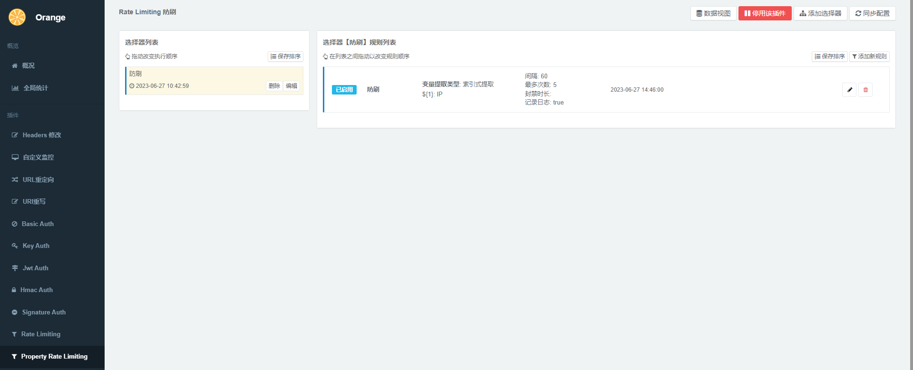

- 回到**orange-1**，进行同步

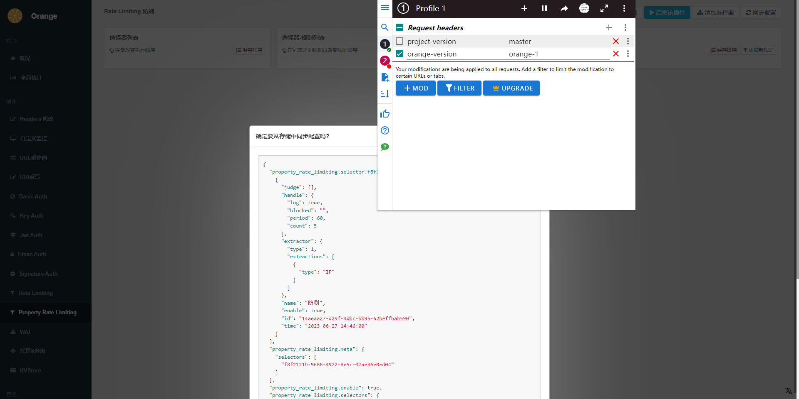

- 同步成功

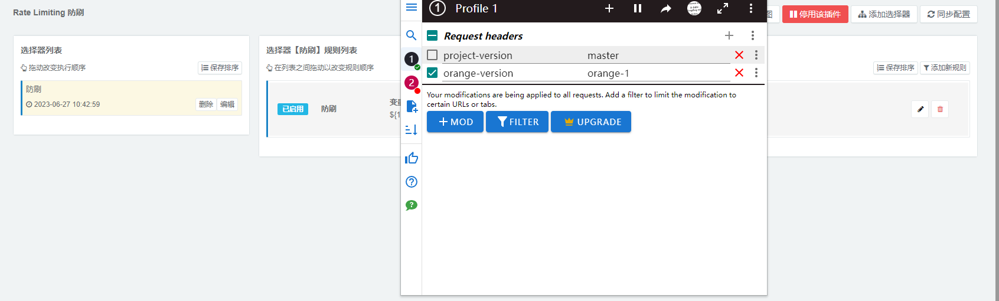

## DDos防刷测试

- 配置dashboard，限制ip ：一小时10次，封禁120秒

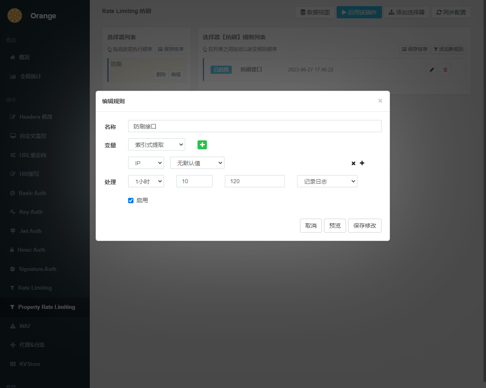

- DDos模拟测试

> 使用工具**LOIC**进行DDos模拟测试，观察**2xx**和**4xx**，以及**conn active**（活跃连接数）

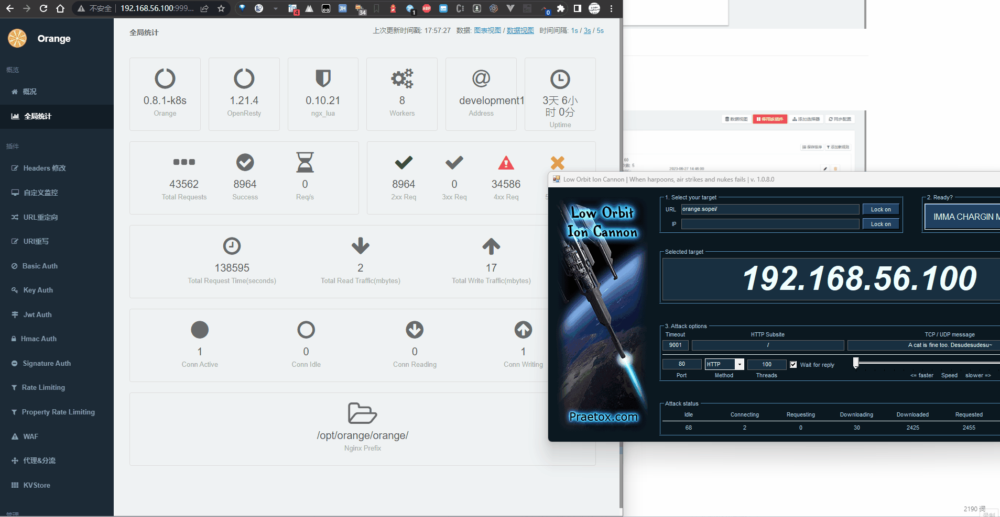

### 测试数据

测试从100线程开始，等待结果响应再发送下一次。看**idle空闲线程**始终有剩余，说明没跑满

最终效果：在10次成功后，剩余请求全部返回4xx

### 问题

#### lua_max_running_timers are not enough

压了一段时间后，网关日志开始出现大量错误

```lua
2023/06/27 17:59:58 [alert] 20102#20102: lua failed to run timer with function defined at @/opt/orange/orange//orange/plugins/monitor/stat.lua:18: 256 lua_max_running_timers are not enough
2023/06/27 17:59:58 [alert] 20102#20102: lua failed to run timer with function defined at @/opt/orange/orange//orange/plugins/monitor/stat.lua:18: 256 lua_max_running_timers are not enough
2023/06/27 17:59:58 [alert] 20102#20102: lua failed to run timer with function defined at @/opt/orange/orange//orange/plugins/stat/stat.lua:53: 256 lua_max_running_timers are not enough
2023/06/27 17:59:58 [alert] 20102#20102: lua failed to run timer with function defined at @/opt/orange/orange//orange/plugins/monitor/stat.lua:18: 256 lua_max_running_timers are not enough
2023/06/27 17:59:58 [alert] 20102#20102: lua failed to run timer with function defined at @/opt/orange/orange//orange/plugins/monitor/stat.lua:18: 256 lua_max_running_timers are not enough
```

这个错误是因为在**自定义监控**插件中，记录监控数据是在log_by_lua中操作的，而这里不允许操作redis，所以我改写成了**ngx.timer.at延迟操作**

但设置被允许的running timers（正在执行回调函数的计时器）的最大数量默认为**256**，如果超过这个数量，就会抛出“N lua_max_running_timers are not enough”，其中N是变量，指的是当前正在运行的running timers的最大数量。

这里需要考虑重写下:**TODO**

#### redis压力

随着压力再加大，redis连接开始逐渐崩掉。所以需要考虑压力更大的情况下，单机redis是否能撑得住。如果和业务模块共用一个redis，会不会拖垮整个业务系统

```LUA
2023/06/27 18:15:45 [error] 20172#20172: *154221 lua tcp socket connect timed out, when connecting to 192.168.56.100:6379, context: ngx.timer, client: 192.168.56.1, server: 0.0.0.0:80
2023/06/27 18:15:45 [error] 20172#20172: *154221 lua entry thread aborted: runtime error: /opt/orange/orange//orange/utils/redis.lua:102: API disabled in the context of ngx.timer
stack traceback:
coroutine 0:
	[C]: in function 'say'
	/opt/orange/orange//orange/utils/redis.lua:102: in function 'connect_mod'
	/opt/orange/orange//orange/utils/redis.lua:195: in function 'get'
	/opt/orange/orange//orange/plugins/base_redis.lua:32: in function 'get_string'
	/opt/orange/orange//orange/plugins/stat/stat.lua:25: in function 'init'
	/opt/orange/orange//orange/plugins/stat/stat.lua:55: in function </opt/orange/orange//orange/plugins/stat/stat.lua:53>, context: ngx.timer, client: 192.168.56.1, server: 0.0.0.0:80
2023/06/27 18:15:45 [error] 20172#20172: *154228 lua tcp socket connect timed out, when connecting to 192.168.56.100:6379, context: ngx.timer, client: 192.168.56.1, server: 0.0.0.0:80
2023/06/27 18:15:45 [error] 20172#20172: *154228 lua entry thread aborted: runtime error: /opt/orange/orange//orange/utils/redis.lua:102: API disabled in the context of ngx.timer
stack traceback:
coroutine 0:
	[C]: in function 'say'
	/opt/orange/orange//orange/utils/redis.lua:102: in function 'connect_mod'
	/opt/orange/orange//orange/utils/redis.lua:195: in function 'get'
	/opt/orange/orange//orange/plugins/base_redis.lua:32: in function 'get_string'
	/opt/orange/orange//orange/plugins/stat/stat.lua:25: in function 'init'
	/opt/orange/orange//orange/plugins/stat/stat.lua:55: in function </opt/orange/orange//orange/plugins/stat/stat.lua:53>, context: ngx.timer, client: 192.168.56.1, server: 0.0.0.0:80
2023/06/27 18:15:45 [error] 20172#20172: *154233 lua tcp socket connect timed out, when connecting to 192.168.56.100:6379, context: ngx.timer, client: 192.168.56.1, server: 0.0.0.0:80
2023/06/27 18:15:45 [error] 20172#20172: *154233 lua entry thread aborted: runtime error: /opt/orange/orange//orange/utils/redis.lua:102: API disabled in the context of ngx.timer
```

#### work_connections are not enough

> nginx默认**worker_connections**（单个工作进程可以允许同时建立外部连接的数量） 为 **4096**，数字越大，能同时处理的连接越多，对应需要的资源也越高
>
> 这里修改默认值为**512**，测试**300**线程，再进行DDos攻击

活跃连接数已经来到**1000**

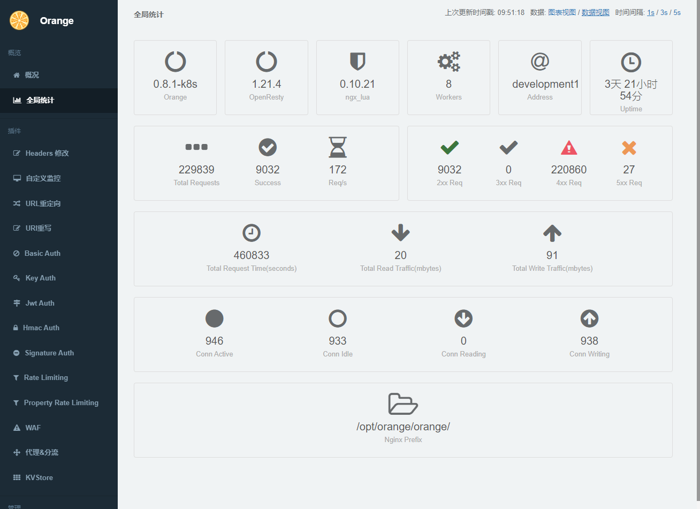

日志开始出现大量`512 worker_connections are not enough`错误

```lua
2023/06/28 09:47:21 [alert] 7829#7829: *51849 512 worker_connections are not enough, client: 192.168.56.1, server: , request: "GET / HTTP/1.0"
2023/06/28 09:47:21 [alert] 7829#7829: *51849 512 worker_connections are not enough, client: 192.168.56.1, server: , request: "GET / HTTP/1.0"
2023/06/28 09:47:21 [alert] 7829#7829: *51849 512 worker_connections are not enough, client: 192.168.56.1, server: , request: "GET / HTTP/1.0"
2023/06/28 09:47:21 [alert] 7829#7829: *51849 512 worker_connections are not enough while connecting to upstream, client: 192.168.56.1, server: , request: "GET / HTTP/1.0", upstream: "http://[::1]:8001/"
2023/06/28 09:47:21 [alert] 7829#7829: *51859 512 worker_connections are not enough, context: ngx.timer, client: 192.168.56.1, server: 0.0.0.0:80
```

### TODO

其他插件的DDos模拟测试

### 结论

orange防止小量次的dos攻击是有效的，但如果高于这个量，可能就需要考虑别的办法
