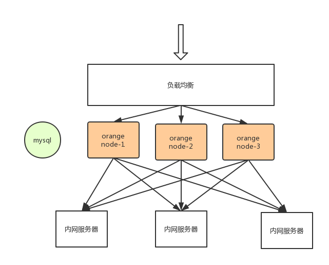
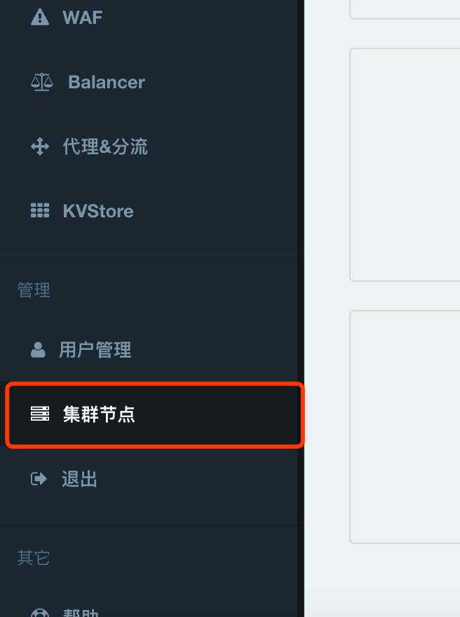
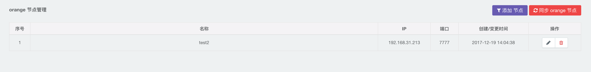
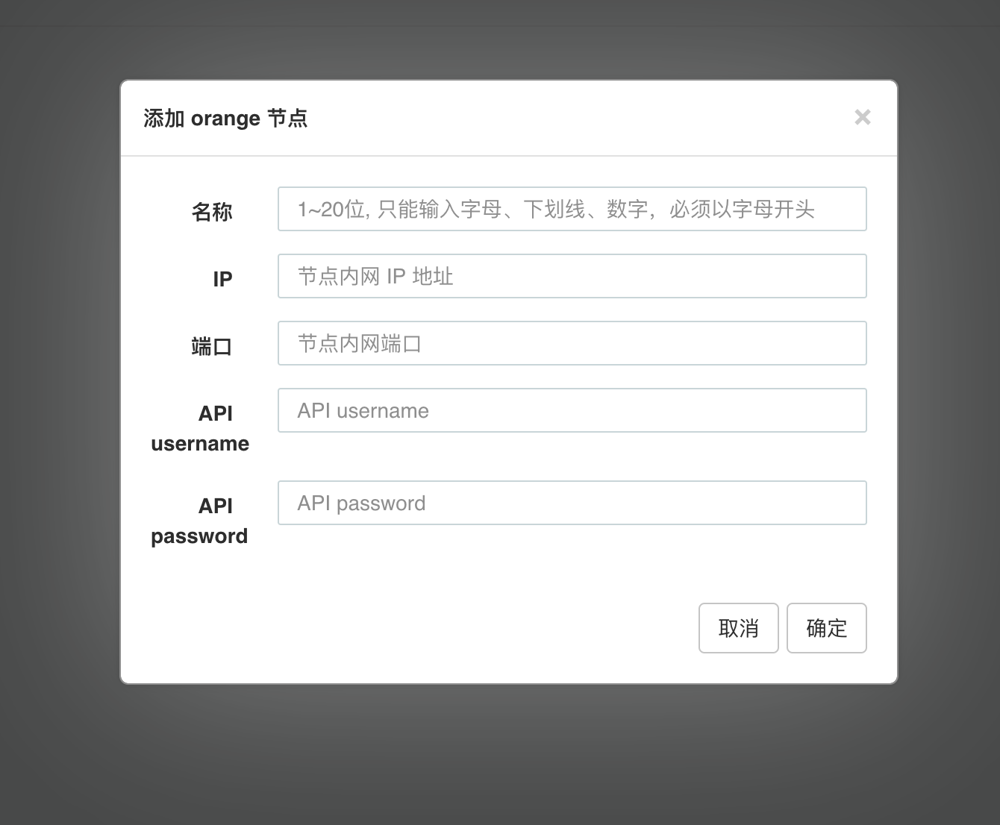
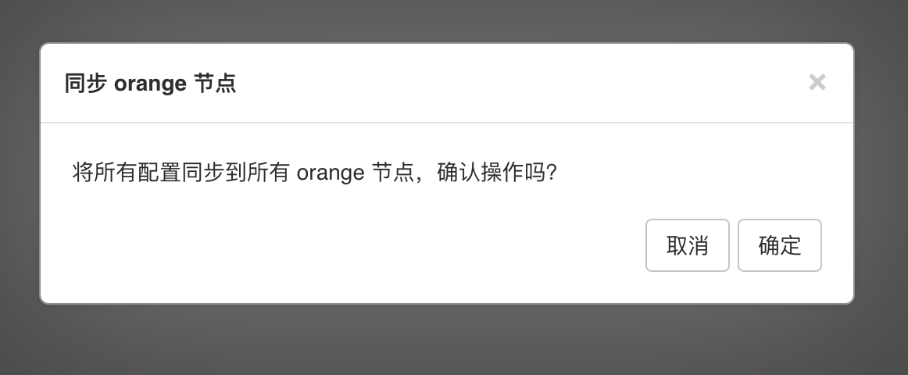

# orange 节点管理

架构图：

如图所示，负载均衡后方的 orange 集群有 3 个 orange 节点，分别为 node-1、node-2、node-3。

常规的操作是登录这 3  个节点中的任一个控制面板进行配置修改操作，修改完成后，需要手动触发其他 2 个节点的 orange reload 维护操作。  

使用 orange 节点管理功能后，只需在配置修改确认后，点击【集群管理】的【同步 orange 节点】按钮同步到所有节点  

### 集群管理

### 集群节点列表

### 添加集群节点

### 同步集群节点
