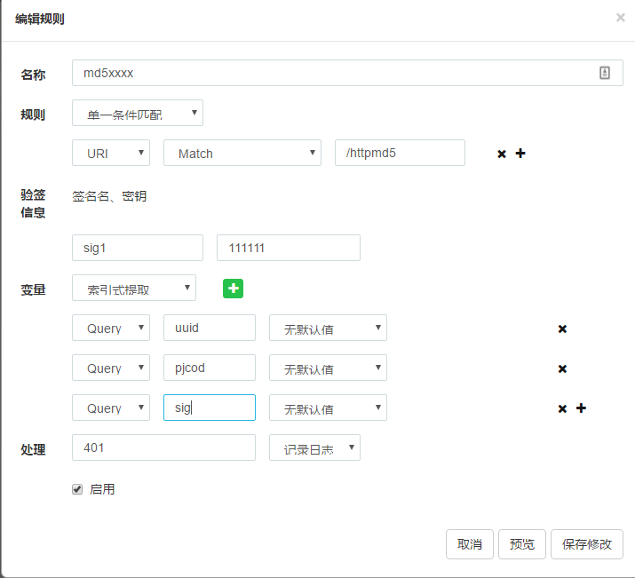

## 签名验证

使用md5做签名验证。基于basic auth 插件修改而来。

下图验证规则是：

`md5(uuid+pjcod+secret key)`

### 验签信息
sig1 是客户端生成的签名，密钥对应的配置为111111

### 变量
变量用于提取所有参与验证签名相关的所有变量，

**注意顺序**，sig可以放在任意位置，注意变量中的sig1,应和上面验签信息中的sig1同名，图中配置的没有同名是错误的:):):)

